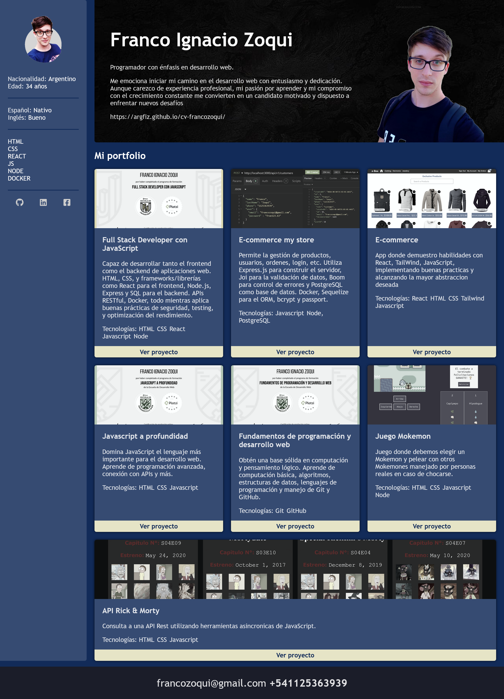

# CV FrancoZoqui

## Full Stack Developer

- **Lenguajes de programación**: JavaScript, SQL

- **Frontend**: React, HTML, CSS
-
- **Backend**: Node.js, Express, Sequelize, Passport

- **Base de datos**: PostgreSQL

- **Herramientas y tecnologías**: Docker, Git, GitHub

## My Skills

**Backend para Proyecto e-commerce** | Junio 2024

- Desarrollo de un backend robusto utilizando Node.js y Express para gestionar la lógica del servidor y las API RESTful.

- Validación exhaustiva de datos de entrada con Joi, garantizando la integridad de la información en las rutas.

- Manejo de errores centralizado y personalizado con Boom, proporcionando respuestas HTTP adecuadas y consistentes.

- Implementación de autenticación segura de usuarios mediante Passport.js, con soporte para estrategias como Local y JWT.

- Interacción eficiente con la base de datos PostgreSQL a través de Sequelize, utilizando un ORM para simplificar las consultas y gestionar migraciones.

- Integración de Docker para configurar un entorno de desarrollo reproducible, asegurando un backend escalable y fácil de administrar.

**Frontend para Proyecto e-commerce** | Junio 2024

- Desarrollo de una interfaz de usuario moderna y receptiva utilizando React, ofreciendo una experiencia de usuario fluida y dinámica.

- Implementación de navegación entre páginas con React Router, facilitando la transición entre diferentes vistas y componentes.

- Estilización de componentes con Tailwind CSS, logrando un diseño atractivo y adaptado a las necesidades del proyecto.

- Integración de Heroicons para proporcionar íconos visualmente atractivos en la barra de navegación y otros componentes clave.

- Gestión del estado global, como el carrito de compras, utilizando la Context API para asegurar una experiencia de usuario coherente y eficiente.

- Adaptabilidad de la interfaz a diferentes dispositivos mediante un diseño responsive, mejorando la accesibilidad y usabilidad en todas las plataformas.

- Persistencia de datos con LocalStorage, permitiendo mantener la información del usuario a través de sesiones y recargas de página.

- Desarrollo de CustomHooks para encapsular y reutilizar lógica de componentes, optimizando la estructura y funcionalidad del código.

